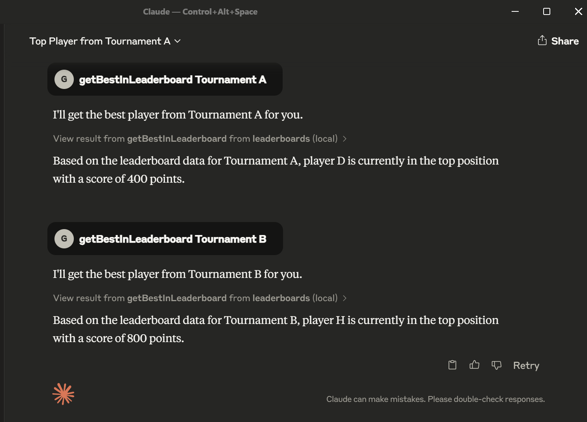

build

```sh
npm run build && docker build -t workshop1_mcp:latest -f Dockerfile .
```

claude desktop client mcp config

```json
{
  "mcpServers": {
    "leaderboards": {
      "command": "docker",
      "args": ["run", "-i", "--rm", "workshop1_mcp:latest"]
    }
  }
}
```


